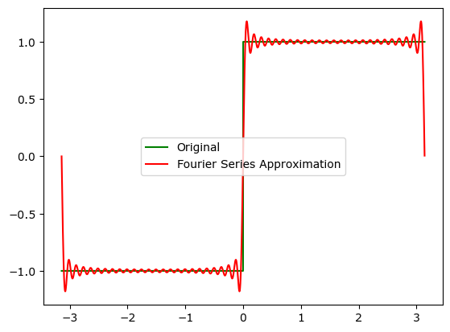
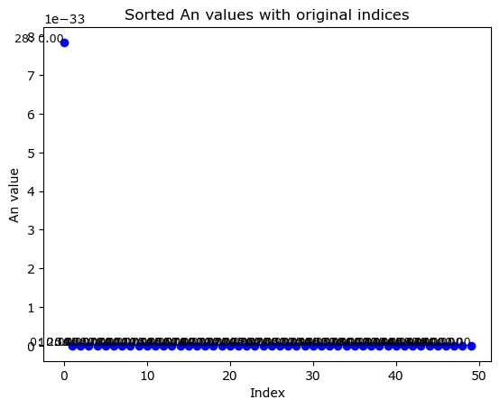
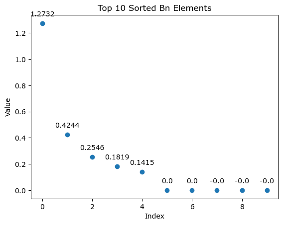

# 1. Fourier series Code
```python
import numpy as np
import matplotlib.pyplot as plt
from scipy.signal import square
from scipy.integrate import quad

x = np.arange(-np.pi, np.pi, 0.001)
y = square(x)

n = 50
An = []
Bn = []
sum = 0

for i in range(n):
    fc = lambda x: square(x) * np.cos(i * x)
    an = quad(fc, -np.pi, np.pi)[0] * (1.0 / np.pi)
    An.append(an)

for i in range(n):
    fs = lambda x: square(x) * np.sin(i * x)
    bn = quad(fs, -np.pi, np.pi)[0] * (1.0 / np.pi)
    Bn.append(bn)

for i in range(n):
    if i == 0:
        sum = sum + An[i] / 2
    else:
        sum = sum + (An[i] * np.cos(i * x) + Bn[i] * np.sin(i * x))

plt.plot(x, sum, 'g')
plt.plot(x, y, 'r--')
plt.title("Fourier Series for Square Wave")
plt.show()
```


    

    


# 2. View the coefficients of An, Bn

An과 Bn의 함수를 그려보기
1. 점으로 그릴 것
   plt.plot의 기능
2. 각 색을 다르게 그릴 것
   plt.plot의 기능 (키워드 인자)
3. 각 리스트를 크기 별로 정리할 것
   sorted() 함수를 사용할 것 (이유는 원래의 리스트를
   정렬된 리스트의 인덱스마다 각 변경전의 리스트의 인덱스가 필요하다.
4. 그리고 어떤 정의역에 대응 되는지 정할 것
   enumerate()를 사용할 것
5. 각 어떤 정의역, 즉 주파수인지 나타내기

순서 생각해보기
1. An에서 가장 큰 순서대로 보기
	- 정렬해서 따로 저장하기 
	- 이전에 어떤 함수였는지도 명시하기

```python
# 예제 리스트
original_list = [4.2, 2.5, 3.7, 1.9, 5.0]

# 요소와 인덱스를 함께 저장하는 리스트 생성
indexed_list = list(enumerate(original_list))

# 두 번째 요소(실제 값)를 기준으로 정렬
sorted_indexed_list = sorted(indexed_list, key=lambda x: x[1])

# 정렬된 결과 출력
for original_index, value in sorted_indexed_list:
    print(f"원래 인덱스: {original_index}, 값: {value}")
```

## [ Creation Process ]

### ( enumerate() test )
1. return은 어떻게 나오나?
   - tuple
   - variable1, variable2 = enumerate(a)에서 variable1 means index, variable2 means element
2. 정의역을 넣는다면 각각은 어떻게 될까? (What happens when you put a list of definitions into an enumerate function?)
   - variable1 = index = index
   - variable2 = element = domain


```python
a = [1, 2]
b, c = enumerate(a)
print(b)
print(c)
print(type(b))
```

    (0, 1)
    (1, 2)
    <class 'tuple'>


```python
import numpy as np
import matplotlib.pyplot as plt
from scipy.signal import square 
from scipy.integrate import quad

n = 50
An = []
Bn = []
sum = 0

x = np.arange(-np.pi, np.pi, 0.001)
y = square(x)

# Fourier coefficients calculation
for i in range(n):
    fc = lambda x: square(x) * np.cos(i * x)
    an = quad(fc, -np.pi, np.pi)[0] * (1 / np.pi)
    An.append(an)

for i in range(n):
    fs = lambda x: square(x) * np.sin(i * x)
    bn = quad(fs, -np.pi, np.pi)[0] * (1 / np.pi)
    Bn.append(bn)

# Fourier series summation
sum = np.zeros_like(x)
for i in range(n):
    if i == 0:
        sum += An[0] / 2
    else:
        sum += An[i] * np.cos(i * x) + Bn[i] * np.sin(i * x)


plt.plot(x, y, 'g', label='Original')
plt.plot(x, sum, 'r', label='Fourier Series Approximation')
plt.legend()
plt.show()

# Sort An list and retain original indices
An_list = list(enumerate(An))
An_sorted_list = sorted(An_list, key=lambda x: x[1], reverse=True)
b = An_sorted_list[0:6]
# Plot sorted An values as discrete points
fig, ax = plt.subplots()
x_vals = range(len(An_sorted_list))
y_vals = [item[1] for item in An_sorted_list]

ax.scatter(x_vals, y_vals, color='blue')

# Add text labels
for i, (original_index, value) in enumerate(An_sorted_list):
    ax.text(i, value, f'{original_index}: {value:.2f}', fontsize=9, ha='right')

ax.set_xlabel('Index')
ax.set_ylabel('An value')
ax.set_title('Sorted An values with original indices')
plt.show()
```


    

    
## [ Result 1 ]

frequency : 점의 위치에 대응 되는 숫자



## [ Result 2 ]

5개의 원소만 확인하기

```python
import numpy as np
import matplotlib.pyplot as plt
from scipy.signal import square
from scipy.integrate import quad


n = 50
An = []
Bn = []
sum = 0
  
x = np.arange(-np.pi, np.pi, 0.001)
y = square(x)

# Fourier coefficients calculation
for i in range(n):
    fc = lambda x: square(x) * np.cos(i * x)
    an = quad(fc, -np.pi, np.pi)[0] * (1 / np.pi)
    An.append(an)

  
for i in range(n):
    fs = lambda x: square(x) * np.sin(i * x)
    bn = quad(fs, -np.pi, np.pi)[0] * (1 / np.pi)
    Bn.append(bn)


# Fourier series summation

sum = np.zeros_like(x)

for i in range(n):
    if i == 0:
        sum += An[0] / 2
    else:
        sum += An[i] * np.cos(i * x) + Bn[i] * np.sin(i * x)


plt.plot(x, y, 'g', label='Original')
plt.plot(x, sum, 'r', label='Fourier Series Approximation')
plt.legend()
plt.show()


# Sort An list and retain original indices

An_list = list(enumerate(An))
An_sorted_list = sorted(An_list, key=lambda x: x[1], reverse=True)
  

# Show only the top 10 An values
top_n = 5
b = An_sorted_list[:top_n]


# Plot top 10 sorted An values as discrete points
fig, ax = plt.subplots()
x_vals = range(top_n)
y_vals = [item[1] for item in b]

ax.scatter(x_vals, y_vals, color='blue')


# Add text labels for the top 10 values

for i, (original_index, value) in enumerate(b):
    ax.text(i, value, f'{original_index}: {value:.2f}', fontsize=9, ha='right')

ax.set_xlabel('Index')
ax.set_ylabel('An value')
ax.set_title(f'Top {top_n} Sorted An values with original indices')
plt.show()
```
![[Pasted image 20240809224507.png]]
    


# 3. A quick look at the coefficients of An Bn

## [ 그래프 그리기 ]

위의 코드에서 

```python
import numpy as np
import matplotlib.pyplot as plt
from scipy.signal import square 
from scipy.integrate import quad

n = 50
An = []
Bn = []
sum = 0

x = np.arange(-np.pi, np.pi, 0.001)
y = square(x)

for i in range(n):
	fs = lambda x: square(x)*np.sin(i*x)
	bn = quad(fs, -np.pi, np.pi)[0]*(1/np.pi)
	Bn.append(bn)
```
y : Sin의 계수
x : i (index)
y는 B[i]이다.
y = B[i]인 함수를 그리면 된다.


## Code 구현하기

1. 연속함수가 아니기 때문에 각 점으로 나타내기 
2. 각 점마다 값이 몇인지 나타내기
	- 4번째자리에서 반올림
	- 반올림은 그래프를 그릴 때만 적용

```python
import numpy as np
import matplotlib.pyplot as plt
from scipy.signal import square 
from scipy.integrate import quad

n = 50
An = []
Bn = []
sum = 0

x = np.arange(-np.pi, np.pi, 0.001)
y = square(x)

for i in range(n):
	fc = lambda x: square(x)*np.cos(i*x)
	an = quad(fc, -np.pi, np.pi)[0]*(1/np.pi)
	An.append(an)

for i in range(n):
	fs = lambda x: square(x)*np.sin(i*x)
	bn = quad(fs, -np.pi, np.pi)[0]*(1/np.pi)
	Bn.append(bn)

Sub_An = An[:10]
Sub_Bn = Bn[:10] #리스트의 처음 10개의 원소 선택
plt.plot(Sub_Bn, marker = 'o' ,linestyle = 'None') #marker가 없이는 linestyle이 None일 때 아무런 그래프의 정보가 나타나지 않는다.
plt.plot(Sub_An, marker = 'x' ,linestyle = 'None')

for i, value in enumerate(Sub_An):
    plt.annotate(str(round(value, 4)), (i, value), textcoords="offset points", xytext=(0,10), ha='center')
for i, value in enumerate(Sub_Bn):
    plt.annotate(str(round(value, 4)), (i, value), textcoords="offset points", xytext=(0,10), ha='center')
```


    

    


값을 소수점 4자리로 반올림하여 표시
```python
값을 소수점 4자리로 반올림하여 표시
for i, value in enumerate(Bn_Sort_in_large_order):
    plt.annotate(str(round(value, 4)), (i, value), textcoords="offset points", xytext=(0,10), ha='center')

plt.xlabel('Index')
plt.ylabel('Value')
plt.title('Top 10 Sorted Bn Elements')
plt.show()
```


    

    

