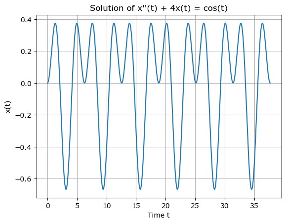
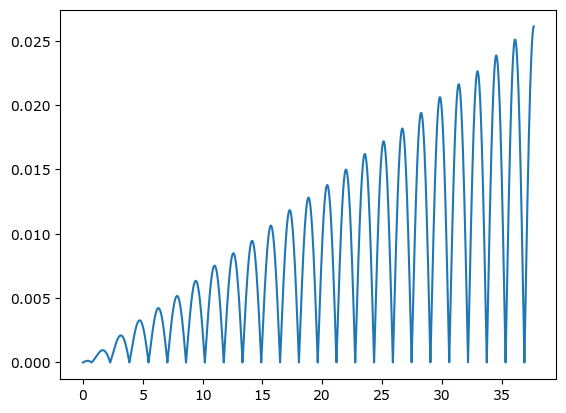

# 1. Code

```python
import numpy as np
import matplotlib.pyplot as plt
delta_t = 0.001

t = np.arange(0, 12*np.pi, delta_t)
x_dotdot = []
x_dot = [0]
x = [0]

n=3

for i in range(len(t)):
    x_dotdot.append(-4*x[i]+np.cos(t)[i])  
    x_dot.append(x_dot[i]+x_dotdot[i]*delta_t)
    x.append(x[i]+x_dot[i]*delta_t)

x.pop()

plt.plot(t, x)
plt.title('Solution of x\'\'(t) + 4x(t) = cos(t)')
plt.xlabel('Time t')
plt.ylabel('x(t)')
plt.grid(True)
plt.show()

```


    

    


# 2. Create Process


1. 정의역의 최솟값이 입력된 최고차항의 계수의 종속변수의 미분 값을 구한다.

x''(0) = x(0)-4 cos(0)

2. 해당 미분 값으로 초기조건과 연쇄적으로 얻어지는 next term value를 input한 각 미분이 된 종속변수 또는 종속변수의 output을 구한다.

x'(delta_t) = x'(0) + x''(0)*delta_t
x(delta_t) = x(0) + x'(0)*delta_t

3. 각 입력되는 정의역에 대응되는 치역이 되도록 index를 맞추어 리스트 또는 배열을 생성한다.

## [ Intermediate Process ( Flow of thought ) ]
```python
import numpy as np
import matplotlib.pyplot as plt
delta_t = 0.001

t = np.arange(0, 6*np.pi, delta_t)
x_dotdot = []
x_dot = [0]
x = [0]


for i in range(len(t)):
    x_dotdot.append(x[i]-4*np.cos(t)[i])  
    x_dot.append(x_dot[i]+x_dotdot[i]*delta_t)
    x.append(x[i]+x_dot[i]*delta_t)

print(len(t))
print(len(x_dotdot))
print(len(x_dot))
print(len(x))
```
Result
18850
18850
18851
18851

점검 사항
t = [0, 0.001, 0.002 ... ]

x= [ index0, index1 (by index0 of t)] 하지만 정의역은 잘 대응된다. 그저 이전 시간이 다음 시간의 값을 도출했을 뿐 둘 중 하나의 리스트를 수정해주면 된다.

정의역을 늘릴 것인가?
치역을 늘릴 것인가?

현재의 구조만 보았을 때는 치역을 줄여주는 것으로 판단했다.
정의역을 늘려주는 방법으로는 따로 정의역을 구조와 맞게끔 재정의해서 변수에 넣어주는 것말고는 없으니


1. 함수자체는 유의미하게 잘 만들어진 것인가? (ivp방법으로 의도한대로)
- 함수 라이브러리를 사용해서 점검하기 (올바르게 나왔다.)


```python
import numpy as np
import matplotlib.pyplot as plt
from scipy.integrate import odeint

# 미분 방정식 정의
def model(y, t):
    x, v = y
    dxdt = v
    dvdt = np.cos(t) - 4*x
    return [dxdt, dvdt]

# 초기 조건
y0 = [0, 0]  # x(0) = 0, x'(0) = 0

# odeint로 미분 방정식 풀이
sol = odeint(model, y0, t)

# 결과 그래프
plt.plot(t, sol[:, 0])
plt.title('Solution of x\'\'(t) + 4x(t) = cos(t)')
plt.xlabel('Time t')
plt.ylabel('x(t)')
plt.grid(True)
plt.show()
```


    

    


# 3. Check the difference between two arrays

Subtract values to see how similar they are, and then find the maximum of those values

```python
print(type(sol))
print(type(x))
print(len(x))
print(len(sol))
```

    <class 'numpy.ndarray'>
    <class 'list'>
    37700
    37700


```python
array_x = np.array(x) #연산의 특징을 고려하여 구조 변경하기
error = np.abs(sol[:, 0] -array_x)

plt.plot(t, error)
# 각 열에서 최대값과 그 인덱스 찾기
max_values_columns = np.max(error, axis=0)
max_indices_columns = np.argmax(error, axis=0)

print("열의 최대값:", max_values_columns)
print("열의 최대값의 인덱스:", max_indices_columns)
```

    열의 최대값: 0.026104221271421424
    열의 최대값의 인덱스: 37699


    

    
