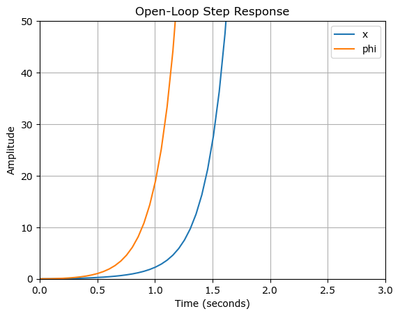

# Inverted Pendulum Model

## [ Inverted Pendulum Model of Matlab Code converted into Python Code ]

url :: https://ctms.engin.umich.edu/CTMS/index.php?example=InvertedPendulum&section=SystemAnalysis

### ( Impulse response, Step response )


```python
import numpy as np
import matplotlib.pyplot as plt
from scipy.signal import lti, impulse, step, lsim

# 시스템 매개변수 정의
M = 0.5
m = 0.2
b = 0.1
I = 0.006
g = 9.8
l = 0.3

q = (M + m)*(I + m*l**2) - (m*l)**2

# 카트의 전달 함수 (P_cart)
num_cart = [(I + m * l**2) / q, 0, -m * g * l / q]
den_cart = [1, (b * (I + m * l**2)) / q, -((M + m) * m * g * l) / q, -b * m * g * l / q, 0]
P_cart = lti(num_cart, den_cart)

# 펜듈럼의 전달 함수 (P_pend)
num_pend = [m * l / q, 0]
den_pend = [1, (b * (I + m * l**2)) / q, -((M + m) * m * g * l) / q, -b * m * g * l / q]
P_pend = lti(num_pend, den_pend)

# 시간 벡터 정의
t_impulse = np.linspace(0, 1, 100)
t_step = np.linspace(0, 10, 200)

# 임펄스 응답 계산
t_cart_imp, y_cart_imp = impulse(P_cart, T=t_impulse)
t_pend_imp, y_pend_imp = impulse(P_pend, T=t_impulse)

# 임펄스 응답 그래프
plt.figure(figsize=(8, 6))
plt.subplot(2, 1, 1)
plt.plot(t_cart_imp, y_cart_imp)
plt.title('Open-Loop Impulse Response')
plt.ylabel('To: x')
plt.grid(True)

plt.subplot(2, 1, 2)
plt.plot(t_pend_imp, y_pend_imp)
plt.xlabel('Time (seconds)')
plt.ylabel('To: phi')
plt.grid(True)
plt.tight_layout()
plt.show()

# 계단 응답 계산
u = np.ones_like(t_step)  # 단위 계단 입력
_, y_cart_step, _ = lsim(P_cart, U=u, T=t_step)
_, y_pend_step, _ = lsim(P_pend, U=u, T=t_step)

# 계단 응답 그래프
plt.figure()
plt.plot(t_step, y_cart_step, label='x')
plt.plot(t_step, y_pend_step, label='phi')
plt.title('Open-Loop Step Response')
plt.xlabel('Time (seconds)')
plt.ylabel('Amplitude')
plt.axis([0, 3, 0, 50])
plt.legend()
plt.grid(True)
plt.show()
```


    

    


    

    


```python

```
