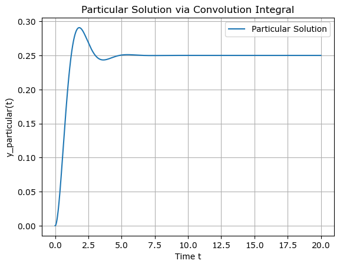

# Import Library and Model setting of MDSS


```python
import numpy as np
import matplotlib.pyplot as plt
from scipy.signal import square
from scipy.integrate import quad

#독립변수, 상수 선언
t = np.arange(0,20,0.001)
m = 1
c = 2
k = 4
x_0 = 0
xdot_0 = 0

```

## Model physical constants and Declare impulse function this model


```python
#필요한 상수들 모델 상수를 조합하여 구하기
w_n = np.sqrt(k/m)
c_cr = 2*np.sqrt(m*k)
xi = c/c_cr
w_d = np.sqrt(1-xi**2)*w_n
phi = np.arctan((w_d*x_0)/(xi*w_n*x_0+xdot_0))

#impulse 함수 선언하기
def impulse_function(t):
    return 1/(m*w_d)*np.exp(-xi*w_n*t)*np.sin(w_d*t)
```

    /private/var/mobile/Containers/Data/Application/19DBF37E-0D38-480B-85C8-87D4349BB176/tmp/ipykernel_781/2222247373.py:19: RuntimeWarning: invalid value encountered in scalar divide
      phi = np.arctan((w_d*x_0)/(xi*w_n*x_0+xdot_0))


# Response of Step Function Input

## [ Make Step Function myself ]

### ( The process of Making )


```python
##list로 함수 만들어보기 연습 (ndarray를 이해하기 위한 과정)
#사고 방식 및 원하는 현상
    #1. y=2x의 관계성을 확인 x = [0, 1, 2], y = [0, 2, 4]
    #2. x의 list의 index0을 추출한다.
    #3. 2를 곱한다.
    #4. y의 list의 index0을 저장한다. 
    #5. 다른 index에 의해서도 반복한다.
    #6. x index n에서 추출 -> y index n으로 삽입

#함수를 정의하기 전 확인해보기
x = [0, 1, 2]
y = []
y.append(2*x[0])
y.append(2*x[1])
y.append(2*x[2])
print(y)

#numpy array 써보기
import numpy as np
x_np = np.array([-1, 1, 2])
y_np = []

for i in range(len(x_np)):
    if x_np[i] >= 0:
        y_np.append(1)
    else:
        y_np.append(0)

#numpy array로 정의역 만들어서 대입해보기
import numpy as np
x_np = np.arange(0,20,0.001)
y_np = []

for i in range(len(x_np)):
    if x_np[i] >= 0:
        y_np.append(1)
    else:
        y_np.append(0)


#Step function 완성 
##함수로 일반화해서 만드는 방법
    #무엇이 input인가? -> 정의역
    #무엇이 ouput인가? -> 치역
    #return값을 어떻게 반환할 것인가? -> list를 사용 및 지역변수를 이용한다. (지역변수는 해당 함수 내에서만 유의미한 변수 그렇다고 return값이 지역변수라고 해서 외부의 코드로 못 나가는 것은 아님)
##예시로 테스트해보기
    #성공
def stepFunction(t):
    y = []
    for i in range(len(t)):
        if t[i] >= 0:
            y.append(1)
        else:
            y.append(0)
    return np.array(y)
```

    [0, 2, 4]


### ( Result )


```python
def stepFunction(t):
    y = []
    for i in range(len(t)):
        if t[i] >= 0:
            y.append(1)
        else:
            y.append(0)
    return np.array(y)
```

## [ Plot Step Step response created by convolution operation of input and impulse functions ]


convolution의 수학적 표현과 해당 문제에서 필요한 것을 통해 수식을 변환시키기
$(1)~\int_0^tf(\tau)*g(t-\tau)=(2)~\int_0^tf(t-\tau)*g(\tau)$
 
- 둘 중 어떤 식을 써야할 지 고민하기
     - 컨볼루션의 함수를 통해 값을 return하는 과정에서 고정되어있는 함수와 변화하는 함수는 항상 필요하다.
     - 정의역이 비교적 편하게 변화할 수 있는 것은 현재 input function(Step_function)이다 (impulse function은 함수로 정의해주지 않았다.
     - 그렇다면 (1)식이라고 갖어했을 때 고정된 $f(\tau)$는 h(t), $h(t-\tau)$는 Step_function

[ 사실 위의 사고방식은 크게 소용없었다... 언젠가는 있지 않을까? ] 

**함수를 만들며 고민된 것**
stepFunction에 1-t라고 넣으면 바로 적용이 되나?
1. t는 어떤 자료형이고 1은 어떤 자료형인가
2. 1-t라는 연산이 가능하며 내가 바라는 방식의 변환으로 이어지는가?
3. 해당 함수는 어떤 인풋을 받아서 어떻게 처리하나
 
 
- 구현되지 않은 범용성있는 convolution 만들기
1. 변수를 몇개 또 어떻게 넣어야하는지 (함수안에서 함수가 작동하게 해야하니)
2. 함수 안에서 함수를 작동하게 할 땐 어떻게 해야하는지
3. return의 자료형은 어떻게 해야하는지

구해보기 위해서는 각 패턴을 줄줄이 늘어놓으면 비슷한 패턴이 보인다. 예를 들면 무엇이 변화하는지 무엇이 정적인지 그리고 for문에서는 변화하는 것이 무엇이고 정적인 게 

### ( The Process of making )

#### 1. 내가 만든 코드

#### 2. 수정1
놓친 점 : i를 바로 써버렸다 t[i]여야 한다. append함수는 ()로 input을 받는다.

#### 3. 수정2
내가 생성한 step function 함수로는 내가 만들어 낸 convolution function으로 동작하지 않는다.
chat gpt가 준 함수와 비교해볼 것

Convolution function
```python
def convolution_for_thisfile(t):
    Y_p = []
    for i in range(len(t)):
        conv_f = lambda x : impulse_function(x)*stepFunction2(t[i]-x)
        y_p, err = quad(conv_f, 0, t[i])
        Y_p.append(y_p)
    return Y_p
```

1. my function
```python
def stepFunction(t):
    y = []
    for i in range(len(t)):
        if t[i] >= 0:
            y.append(1)
        else:
            y.append(0)
    return np.array(y)
```
2. chat gpt function
```python
def stepFunction(t):
    return 1 if t >= 0 else 0
```


##### Chat Gpt Whole Code


```python
import numpy as np
import matplotlib.pyplot as plt
from scipy.signal import square
from scipy.integrate import quad

# 독립변수, 상수 선언
t = np.arange(0, 20, 0.001)
m = 1
c = 2
k = 4
x_0 = 0
xdot_0 = 0

# 필요한 상수들 모델 상수를 조합하여 구하기
w_n = np.sqrt(k/m)
c_cr = 2*np.sqrt(m*k)
xi = c/c_cr
w_d = np.sqrt(1-xi**2)*w_n
phi = np.arctan((w_d*x_0)/(xi*w_n*x_0+xdot_0))

# Impulse 함수 선언하기
def impulse_function(t):
    return 1/(m*w_d)*np.exp(-xi*w_n*t)*np.sin(w_d*t)

h_t = impulse_function(t)

# Step 함수 선언하기 (단일 값에도 동작하도록 수정)
def stepFunction(t):
    return 1 if t >= 0 else 0

# Convolution integral을 계산하는 함수
def convolution_for_thisfile(t):
    Y_p = []
    for i in range(len(t)):
        # Convolution 적분 함수
        conv_f = lambda x: impulse_function(x) * stepFunction(t[i] - x)
        y_p, _ = quad(conv_f, 0, t[i])  # t[i]까지의 적분
        Y_p.append(y_p)
    return np.array(Y_p)

# Particular solution 계산
y_particular = convolution_for_thisfile(t)

# 그래프 그리기
plt.plot(t, y_particular, label='Particular Solution')
plt.xlabel('Time t')
plt.ylabel('y_particular(t)')
plt.title('Particular Solution via Convolution Integral')
plt.legend()
plt.grid(True)
plt.show()
```

    /private/var/mobile/Containers/Data/Application/19DBF37E-0D38-480B-85C8-87D4349BB176/tmp/ipykernel_506/1611490160.py:19: RuntimeWarning: invalid value encountered in scalar divide
      phi = np.arctan((w_d*x_0)/(xi*w_n*x_0+xdot_0))


    

    


# Error in progress during process and file creation
1. sqrt에 음수가 들어가서 생긴 에러
   그 결과 w_d, phi는 nan이 되었다, phi가을 구하기 위해서 w_d가 필요하기 때문이다.
   w_d = np.sqrt(xi**2-1)*w_n를 w_d = np.sqrt(1-xi**2)*w_n로 바꾸어 주었다
2. xdot_0에 0을 넣었더니 phi = np.arctan((w_d*x_0)/(xi*w_n*x_0+xdot_0))가 0/0이 되어서 어떤 값도 가지지 않는다.
    지금은 무시하기
3. list의 index의 값을 변경해주기 위해서는 해당 index에 값이 존재해야한다.
4. convolution function 만들던 도중 에러가 났다, 일단 할 수 있는 것 중 하나인 impusle function 함수로 만들어주기
5. 각 동작들이 연결될 수록 통합성을 만들어주기 위해서는 목적과 범주를 정하고 각 입력과 아웃풋 그리고 각 그것에 필요한 규칙성들을 알아야한다.
6. (물리적 이해) 0.25가 된 것을 hook's law와 연결지어 이해하던 도중 의문이 들었다. 감쇄항으로 소실된 에너지가 고려되었다면 위치는 좀 더 낮아져야하는 것이 아닌가? 아니다. 힘은 지속적으로 1N의 크기로 가해지고 있으며, 짧은 시간 간격으로 에너지는 전달이 된다. 초기에 제공된 에너지가 소실되는 양보다 증가하는 양이 더 많을 때 steady state상태의 에너지보다 잠깐 높은 순간을 가진다. 하지만 이는 곧 소진되며  제공되는 에너지와 소실되는 에너지가 균형을 이루었을 때 위치는 유지된다. 방금 내가 말한 방식의 거동이 관찰되는 것은 임펄스 응답에서는 볼 수 있다. 더 빠르게 위치가 원점으로 돌아오는 것(운동량이 제공되었기 때문에, 즉 에너지가 제공이 되었다.)  (힘이 계속 공급되는 것과 에너지가 공급되는 것은 다르다. 전류가 흘러도 저항이 없이는 일이 생기지 않는 것처럼 ) (또한 위치만의 정보로 해당 상태의 질량이 가진 에너지를 판단할 수는 없다. 속도에너지에 대한 것의 고려가 없기 때문이다. )
