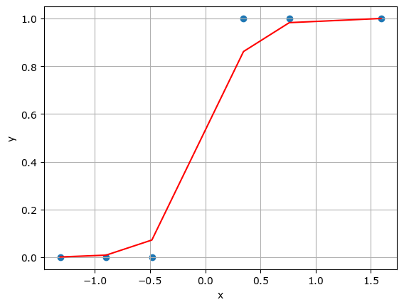

# Linear Regression


```python
import random
import matplotlib.pyplot as plt
import pandas as pd

data = pd.DataFrame({'x':[1,2,3,4,5],'y':[1.5,2.5,4,5,7]})

learningrate = 0.001
a = random.random()
b = random.random()
epochs = 500
n = len(data.x)
mse_list = []
colors=['red','yellow','cyan','magenta','green']

plt.figure(figsize=(10,10))
plt.grid(True)
plt.scatter(data.x, data.y)

for i in range(epochs):
    cost_a = sum(-(data.x*(data.y-(a*data.x+b))))/n
    cost_b = sum(-(data.y-(a*data.x+b)))/n
    mse = sum((data.y - (data.x * a + b))**2)/n
    mse_list.append(mse)
    
    if i % (epochs // 5) == 0:
        print(f'a:{a:.2f}, b:{b:.2f}, mse:{mse_list[len(mse_list)-1]:.2f}')
        data['res'] = a * data.x + b
        lbl = 'epoch {:>5} - mse: {:>9.3f}'.format(i, mse)
        plt.plot(data.x, data.res, linestyle='dashed', color=colors.pop(), label=lbl)

    a = a - learningrate * cost_a
    b = b - learningrate * cost_b

plt.legend()
plt.show()

```

    a:0.16, b:0.71, mse:10.75
    a:0.80, b:0.86, mse:1.21
    a:1.00, b:0.90, mse:0.32
    a:1.06, b:0.90, mse:0.23
    a:1.08, b:0.89, mse:0.22


    


# Rogistic Regression

url :: https://m.blog.naver.com/seodaewoo/223021832759


```python
%%writefile data.csv
х, У
1,0
2,0
3,0
5,1
6,1
8,1
```

    Overwriting data.csv


```python
import numpy as np
import pandas as pd

import matplotlib.pyplot as plt

data = pd.read_csv("data.csv")

x = data.iloc[:, :-1].values
y = data.iloc[:, -1].values

x = (x - np.mean(x)) / np.std(x)

def sigmoid(z):
    return 1 / (1 + np.exp(-z))

def loss(h, y):
    return (-y * np.log(h) - (1 - y) * np.log(1 - h)).mean()

def logistic_regression(x, y, epochs, lr):
    w = np.zeros(x.shape[1])
    for i in range(epochs):
        z = np.dot(x, w)
        h = sigmoid(z)
        error = h - y
        gradient = np.dot(x.T, error) / y.size
        w -= lr * gradient
        if i % 1000 == 0:
            h = sigmoid(np.dot(x, w))
            print(f"손실 함수 값: {loss(h, y)}")
    return w

w = logistic_regression(x, y, epochs=10000, lr=0.01)
print("가중치: ", w)

print(sigmoid(np.dot(x, w)))

plt.grid(True)
plt.scatter(x, y)
plt.xlabel("x")
plt.ylabel("y")
plt.plot(x, sigmoid(np.dot(x, w)), color='red')
plt.show()
```

    손실 함수 값: 0.6911281763696361
    손실 함수 값: 0.19271834378510724
    손실 함수 값: 0.12581244563736724
    손실 함수 값: 0.09684048649141498
    손실 함수 값: 0.07996972975129836
    손실 함수 값: 0.06869153480008859
    손실 함수 값: 0.06051938857985467
    손실 함수 값: 0.05427549922846891
    손실 함수 값: 0.04932203046848526
    손실 함수 값: 0.045280225319875876
    가중치:  [5.28198588]
    [9.65508709e-04 8.57991922e-03 7.19216903e-02 8.61381628e-01
     9.82346129e-01 9.99775933e-01]

    

    

